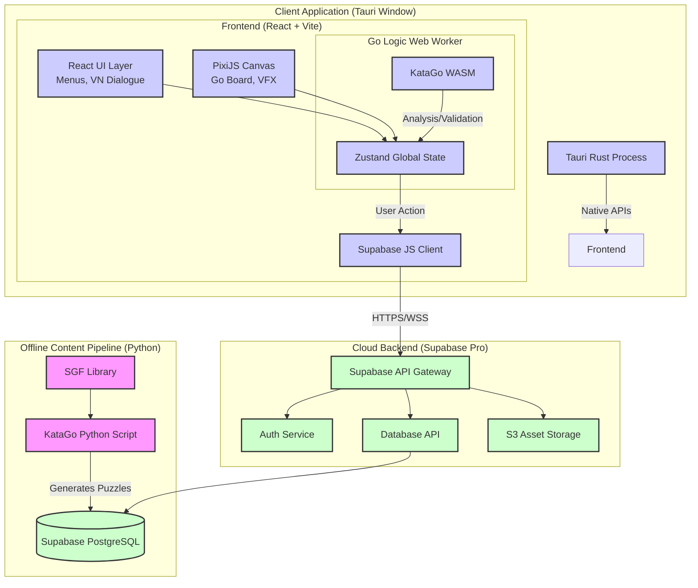

Here is the **Architecture Overview**. This document serves as the technical blueprint for the project. It tells the AI coding agents *what* technologies to use, *why* they were chosen, and *how* they interact.

It is structured to enforce the "Local-First" development strategy we agreed upon to minimize rework.

-----

# 03\_Architecture\_Overview.md

# Architecture Overview: The Hybrid Stack

**Project:** Yokai Love Tsumego: A Yokai Dating Sim
**Version:** 1.0.0
**Context:** This document defines the technical stack, component relationships, and data flow. It is the definitive guide for AI agents regarding library choices and architectural patterns.

-----

## 1\. High-Level Stack Summary

We are building a **Hybrid Application**. It uses web technologies for the game logic and UI, wrapped in a native Rust container for desktop performance and Steam integration, powered by a SQL backend-as-a-service.

| Component | Technology | Rationale |
| :--- | :--- | :--- |
| **Frontend Framework** | **React 18 + Vite** | Fast development, massive ecosystem, AI agents are highly proficient in React. |
| **Game Engine (2D)** | **PixiJS (v8+)** | High-performance WebGL rendering required for the Go board, particle effects (aura), and intricate UI animations. React alone is too slow for the board state. |
| **Desktop Wrapper** | **Tauri v2 (Rust)** | Significantly smaller bundle size and better memory usage than Electron. Provides secure native APIs for file I/O and Steamworks integration. |
| **State Management** | **Zustand** | Simple, minimalist global state management. Easier for AI agents to manage than Redux without boilerplate bloat. |
| **Backend (BaaS)** | **Supabase (PostgreSQL)** | Chosen over self-hosted options for reliability and ease of AI integration with standard SQL. Provides Database, Auth, and Asset Storage. |
| **AI Engine (Go)** | **KataGo (WASM & Python)** | The industry standard open-source Go AI. Used in two distinct ways (client-side and backend-side). |

-----

## 2\. System Architecture Diagram

-----

## 3\. Component Breakdown & Rationale

### A. The Client (Frontend)

The frontend is split into two distinct rendering layers that must communicate:

1.  **The React Layer (HTML/CSS):** Handles all menus, VN dialogue boxes, buttons, and resource counters. It uses standard DOM elements, styled via CSS Modules or Tailwind (TBD in Tech Spec), matching the "painterly wood/paper" aesthetic defined in the Art Bible.
2.  **The PixiJS Layer (WebGL Canvas):** A single canvas element sitting behind the React UI. It renders the Go board, stones, and crucial VFX (the glowing "AI Heatmap" aura, particle effects on stone placement).

**Why split them?** Rendering 361 interactive stones + complex glowing particle effects directly in the React DOM causes performance stuttering on mobile. PixiJS handles this effortlessly via WebGL.

**UX Strategy: The "Central Square"**
To ensure consistency across Desktop (Landscape) and Mobile (Portrait), the core gameplay area (the Go Board) is strictly constrained to a **1:1 aspect ratio container**.
*   **Desktop:** The square sits in the center; info panels flank left/right.
*   **Mobile:** The square sits in the center; info panels stack above/below.
*   **Input:** User configurable "One Tap Move" (Speed) or "Tap to Place + Tap to Confirm" (Precision).

### B. The Go AI Engine (KataGo)

We use KataGo in two different roles:

1.  **Client-Side (WASM):** A lightweight version runs in a browser Web Worker.

      * *Role:* Real-time input validation (is this move legal?), calculating the score estimate, and generating the "Heatmap" visualization for Teaching Mode.
      * *Constraint:* Must be optimized for low memory usage on mobile.

2.  **Backend-Side (Python):** A powerful, full-strength version runs offline on our dev machine (or a separate VPS).

      * *Role:* The "Puzzle Factory." It scans thousands of pro SGF games, identifies blunders, crops the board position, verifies that there is only *one* correct solution, and uploads the resulting JSON puzzle to Supabase.

### C. The Backend (Supabase)

We utilize the standard Supabase stack.

  * **PostgreSQL Database:** Stores user profiles, game progress (floors cleared), puzzle data (SGF strings, solutions), and companion unlock states. We rely heavily on **Row Level Security (RLS)** to ensure users can only access their own data.
  * **GoTrue (Auth):** Handles secure sign-up/login.
    *   *MVP Note:* We will use **Platform-locked Accounts** initially (Steam ID / Device ID) to simplify development. Cross-save architecture will be designed but not implemented for V1.
  * **Storage:** An S3-compatible bucket storing all the high-resolution Waifu sprites, background art, and audio files. The client fetches these via public URLs.

-----

## 4\. Key Data Flows

### Example: Submitting a Move in the Tower

1.  **Input:** Player taps an intersection on the PixiJS board.
2.  **Client Validation:** PixiJS sends coordinates to React State -\> React sends to KataGo Web Worker. Worker confirms move is legal.
3.  **Optimistic Update:** React immediately places the stone on the board (UI update).
4.  **Server Request:** The Supabase Client sends an RPC call (or database insert) to submit the move to the cloud.
5.  **Server Verification:** Supabase receives the move. (Optional: An Edge Function could double-check the move against the stored puzzle solution for anti-cheat).
6.  **Response:** The server confirms success and rewards (Spirit Stones). React State updates the resource counters.

-----

## 5\. Development Workflow Strategy (Local-First)

To avoid future rework, we strictly adhere to a **Local-First** development approach using the Supabase CLI.

  * **NO "Fake APIs":** We do not build prototypes using hardcoded JSON data.
  * **Local Docker:** Every developer (and AI agent) runs `supabase start` locally. This spins up a complete, isolated replica of our production backend (DB, Auth, Storage) on `localhost`.
  * **Migrations:** Database schema changes are managed via Supabase migrations committed to Git.
  * **Seeding:** We use seed scripts to populate the local database with dummy users and test puzzles.

**The Golden Rule:** *The React/Tauri client code should not know if it is connecting to `localhost:54321` or `https://api.tsumegotower.com`. It just uses the environment variables.*